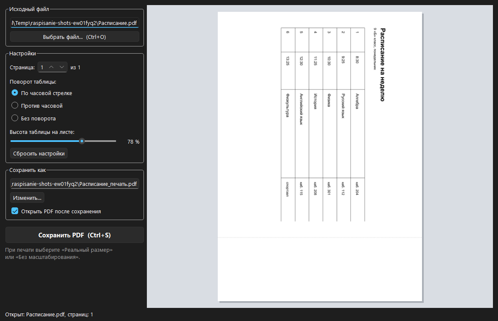

<div align="center">

# Schedule to Print

**Takes a timetable laid out on a landscape A4 page (`.docx` or `.pdf`), turns it 90° and places it in the upper half of a portrait A4 sheet. The empty lower half is marked with a dotted cut line.**

[Download for Windows](https://github.com/ALEXalesha/Converter/releases/latest) &nbsp;·&nbsp; [Русская версия этого файла](README.ru.md)

[](https://github.com/ALEXalesha/Converter/actions/workflows/ci.yml)
[](https://github.com/ALEXalesha/Converter/releases/latest)
[](LICENSE)



</div>

> **The interface is in Russian**, and so is the documentation in `docs/`. The command line is English.

## Why it exists

A school timetable arrives as a landscape A4 page. Printed as it is, it fills the whole sheet, and half a sheet is what actually fits a folder or a wall. Doing it by hand means rotating the page in some editor, scaling it, guessing the margins, and doing that again next week.

This program does exactly that one thing: rotate, scale to the top half, mark the cut line, save a PDF next to the original. Nothing else.

## Download

| File | What it is |
| --- | --- |
| `RaspisaniePrint-Setup-<version>.exe` | Installer. No admin rights. Optionally adds a *Подготовить к печати* entry to the right-click menu of `.docx` and `.pdf` files |
| `RaspisaniePrint-portable-<version>.zip` | Unpack anywhere, including a flash drive, and run `RaspisaniePrint.exe` |

Windows 10 or 11, x64. PDF input works on its own; Word formats (`.docx`, `.doc`, `.rtf`, `.odt`) need Microsoft Word installed, because the conversion goes through Word itself.

## Using it

1. Open a file with the button, `Ctrl+O`, or by dragging it into the window.
2. The preview on the right shows the finished sheet. Adjust the rotation direction and how much height the table takes.
3. `Ctrl+S` saves the PDF next to the original with a `_печать` suffix.
4. In the print dialog choose "actual size" or "no scaling", otherwise the printer will shrink it again.

Settings are remembered between runs, and since 2.1.0 so are the window's size and place. Details: [docs/user-guide.md](docs/user-guide.md) (in Russian).

## Command line

```bash
python raspisanie_print.py "Расписание.docx"
python raspisanie_print.py "Расписание.pdf" -o print.pdf --scale 0.9 --rotate 90 --page 2
```

| Option | Meaning | Default |
| --- | --- | --- |
| `-o`, `--output` | Where to write the PDF | next to the input, `<name>_печать.pdf` |
| `--scale` | Share of the sheet height the table takes, 0 to 1 | `0.78` |
| `--rotate` | `270` clockwise, `90` counter-clockwise, `0` none | `270` |
| `--page` | Page number, starting at 1 | `1` |

Exit codes: `0` success, `1` bad input with the reason on stderr, `2` wrong arguments.

## Qt since 2.0

The window was rewritten from tkinter to Qt (PySide6) in version 2.0. Tkinter lagged while the window was being resized, did not follow the Windows dark theme, and could not accept a dropped file. All three came for free with Qt. The port is written up in [docs/qt-port.md](docs/qt-port.md).

## Tests

```bash
pip install -r requirements-dev.txt
python -m pytest
```

123 tests, about 40 seconds. Five of them need Microsoft Word and skip themselves when it is not installed, which is what happens on CI.

The interesting part is not the count. The bugs were found by feeding the old code bad input on purpose and then turning every hit into a test - scale above 1 or `nan` accepted silently, page `-1` quietly taken as the last page, output path equal to the input path crashing mupdf with "permission denied", the finished PDF left half-written when it was open in a viewer. After that, property tests with hypothesis checked the invariants over thousands of random inputs: page sizes, a page with its own `/Rotate`, scale, rotation, page number, file names, corrupted settings. The whole list with what each hypothesis found is in [docs/testing.md](docs/testing.md).

## Building

```powershell
powershell -ExecutionPolicy Bypass -File build.ps1
```

Builds both the installer (Inno Setup) and the portable zip into `dist/`.

## Screenshots are generated

`tools/make_screenshots.py` builds a sample timetable, opens it in the real window and captures the widget with `grab()`. A screen grab by window rectangle would be wrong here: a window that just opened can sit behind others, and then the shot catches someone else's content.

## Licence

MIT, see [LICENSE](LICENSE).
